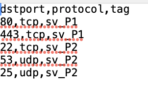
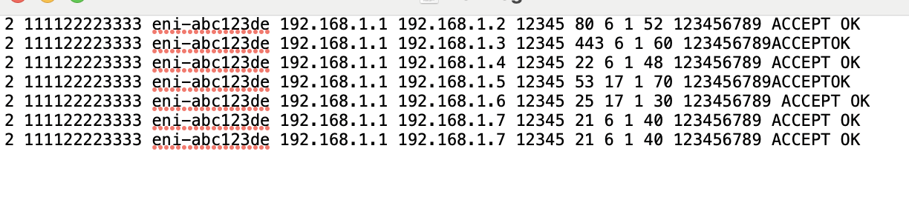
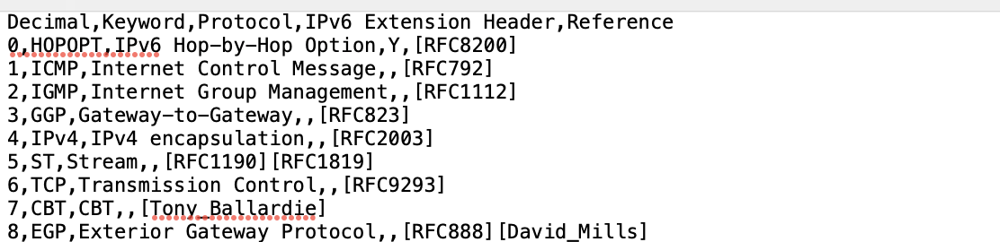

# FlowLog Tagging and Analysis Engine (FLTAE)

## Project Overview

The FlowLog Tagging and Analysis Engine (FLTAE) is a Java-based tool designed to parse flow log files, map each entry to a specific tag based on a predefined lookup table, and generate reports on tag counts and port/protocol combinations. This project is structured for scalability and ease of maintenance, with clear modularization of the different components.

### Prerequisites

- **Java Development Kit (JDK):** Ensure that JDK 8 or higher is installed on your machine.
- **Command-line Interface (CLI) or Integrated Development Environment (IDE):** The project can be built and run using a standard CLI or IDE like IntelliJ IDEA.

## Assumptions

- **File Format:**
    - The `lookup.csv` file contains mappings of destination ports, protocols, and tags **in that order.**
    - The `flowlog.txt` file is assumed to contain space-separated entries representing flow log data. **It is assumed that dstport and protocol are 7th and 8th column in file** 
    - The `[protocol-numbers.csv]` file maps protocol numbers to their respective names.

- **Line Terminators:**
    - It is assumed that the flow log file will have standard line terminators and columns are separated by spaces .

- **Case Insensitivity:**
    - The matching of ports, protocols, and tags is case-insensitive.

- **Error Handling:**
    - If a port/protocol combination does not exist in the lookup table, the entry is tagged as "Untagged".
    - Unknown protocol numbers that do not map to recognized protocol names are tagged as "unknown".

## Sample File Formats

### LookUpTable.csv:

Here is the sample `LookUpTable.csv`:

  

### FlowLogFile.txt

Here is the sample `FlowLogFile.txt`:



### Protocol-Numbers.csv

Here is the sample `Protocol-Numbers.csv`:




## Compilation and Running Instructions

### Compilation

To compile the project, navigate to the `project-root` directory and run the following command in your terminal:

```bash
javac -d build src/main/tagmapper/TagMapper.java
javac -d build -cp build src/main/flowlogparser/FlowLogParser.java
javac -d build -cp build src/main/outputgenerator/OutputGenerator.java
javac -d build -cp build src/main/Main.java
```
This command compiles all the Java files in the src/main/ directory and its subdirectories, placing the compiled .class files in the build directory.


### Running Instructions

**1st Argument:** - Path to lookup.csv file
**2nd Argument:** - Path to flowlog.txt file
**3rd Argument:** - Path to protocol-numbers.csv file


```bash
java -cp build main.Main input/lookup.csv input/flowlog.txt input/protocol-numbers.csv
```


## Tests
Manual tests were you used to verify the functionality.Unit test and Integration tests will be  implemented for this project by which we can verify the correctness of the flow log parsing, tag mapping, and output generation functionalities.


